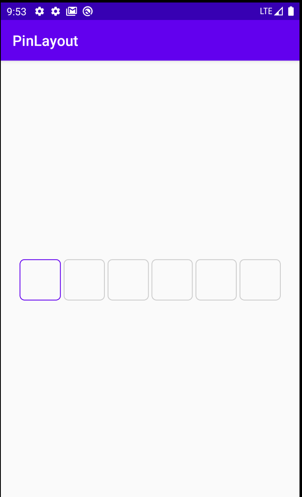
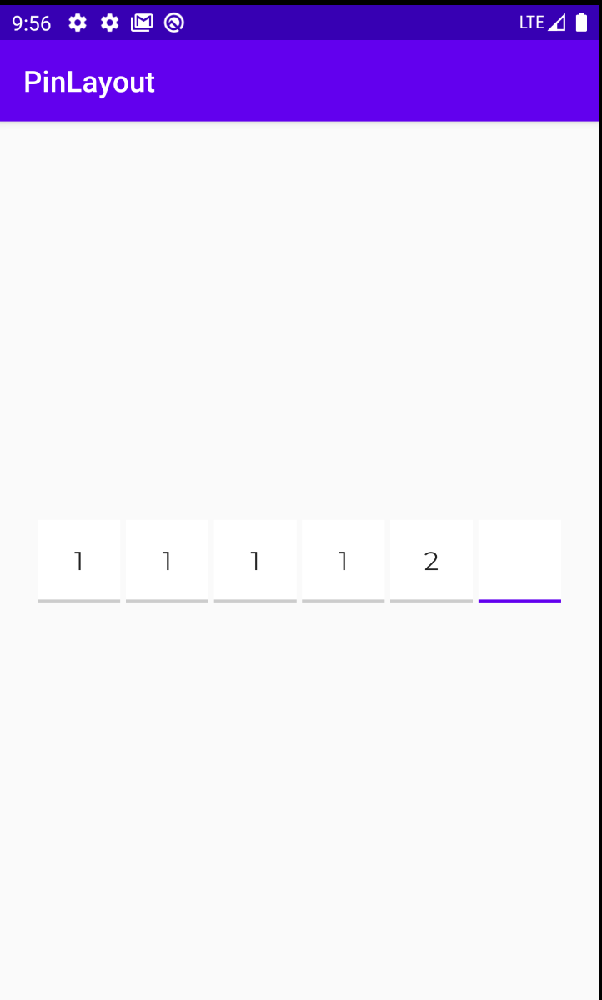

### Customize Pin Layout  

You can customize pin layout by adding custom drawables in **res** folder of your project  

### Example: Full drawables. You can find the example in app folder  

### Example: Underline drawables. You can find the example in app folder  

### Custom params:  

| Attribite name                   | Description                
| ---------------------------------|:--------------------------------------------------:|
| **pin_unselect_background**      | Background of unselect but **full** pin item    | 
| **pin_unselect_empty_background**| Background of unselect but **empty** pin item   |  
| **pin_select_background**        | Background of select item                       |    
| **pin_count**                    | Count of pin items                              |  
| **pin_margin**                   | Margin between items                            |  
| **pin_font**                     | Custom font. Put your font in **assets/fonts**  directory. Then create string resource with font name  and set it value in **pin_font**  attribute |  

### Custom methods and properies

| Name                      | Description                                       |
|----------------------------------|:------------------------------------------------ :|    
| ** onFullListener **             | Property. Callback, when pin layout full or not full          
| ** pin **                        | Property. String value of current pin
| ** clear **                      | Method, clear pin layout
| ** isFull **                     | Property.           
  